# RockCoast10Be
Latest version: 2.0 (2025-07-01)

<em>RockCoast10Be.m</em> is a backward geometry-based model developped in MATLAB to explore cosmogenic 10Be concentrations across an active shore platform as a function of cliff retreat and shore platform down-wearing scenarios. It may be used to either explore the expected concentrations or to find a best-fit scenario if 10Be data are available.

Please refer to the original paper when using this work: 
Swirad, Z. M. et al. 2020. Cosmogenic exposure dating reveals limited long-term variability in erosion of a rocky coastline. Nature Communcations  11: 3804. https://doi.org/10.1038/s41467-020-17611-9

The original code is provided as a supplement to Swirad et al. (2020). The GitHub repository contains a simplified and updated model. On the top of clearer nomenclature, the differences include:
1. The empirical model of shore platform erosion at Staithes, UK was removed because of its limited utility elsewhere;
2. The required tidal information was limited to a single value of tidal range;
3. Topographic shielding is based on cliff geometry (inclination [90 degrees for a vertical cliff] and subtended azimuth [180 degrees for a cliff straight alongshore] angles);
4. Best-fit scenario can be identified based on the mean squared difference. If no 10Be data are available, please comment lines #24 and from #508 on.

The model requires three input files: 1. timeseries of geomagnetic scalar (<em>geomagnetics.txt</em> available in the repository), 2. topography data (a series of distances from the cliff and elevations) and 3. relative sea level (RSL) data (a series of time BP and RSL). 10Be concentration file can also be included for finding the best-fit scenario. The concnetration file should have been corrected for inheritance beforehand. Then a number of variables needs to be defined: total time considered, shore platform width, tidal range, highest and lowest astronomical tide or highest and lowest elevation of shore platform above RSL, cliff height, inclination angle and subtended azimuth angle.

Scenarios considered:

Cliff retreat scenarios:
- steady retreat
- linear acceleration
- linear deceleration

Shore platform erosion scenarios:
- zero platform erosion
- steady-state model (platform slope remains constant)
- platform widening model (slope decreases through time)

The user defines the rates for the steady cliff retreat. For the accelerating/decelerating scenarios the user defines the current rate as well as the series of values which mean how many times the retreat rate was higher/lower and the begining of the considered period.

All shore platform erosion scenarios are run; they are fully controlled by the current topography and the RSL history.

<b>Workflow - example from Staithes, UK:</b>

The four files used to run the code for Staithes () are available in the repository. The user-defined parameters in the code file (<em>RockCoast10Be.m</em>) are also set to this example. If the user runs the code using the four input files, they will receive the same results. For other locations, different inputs are needed.

When input files are loadad and all parameters are set, the figures of cliff retreat rates through time and the resulting exposure ages are created for each cliff retreat scenario.

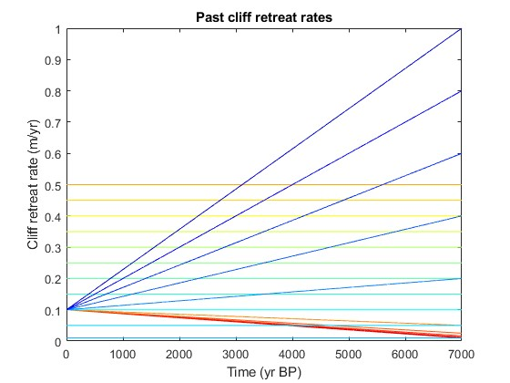
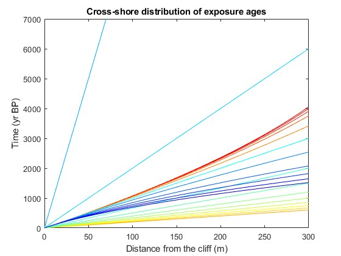

For each cliff retreat scenario the geomagnetic scalard is calculated.

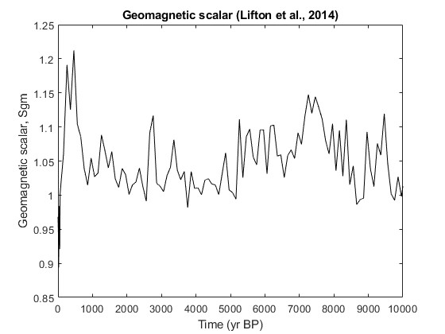
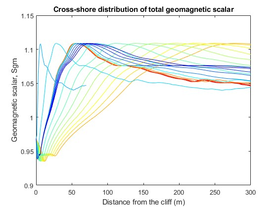

Similarly, each cliff retreat scenario has a different topographic shielding distribution.

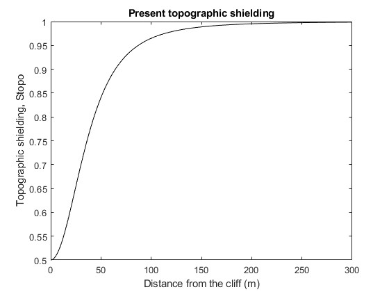
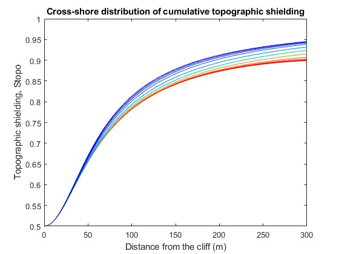

Subsequently elevations, RSL and present water shielding (tidally-dependent) are explored.

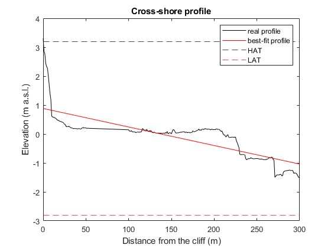
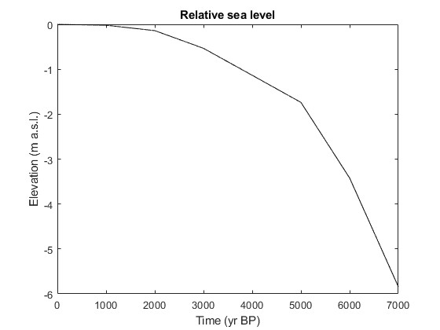
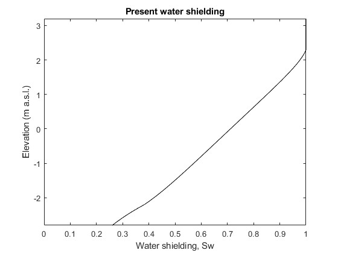

Water shielding and platform erosion scalar (rock shielding) are calculated separately for the three scenarios of shore platform erosion. For zero platform erosion Ser=1 and is not plotted.

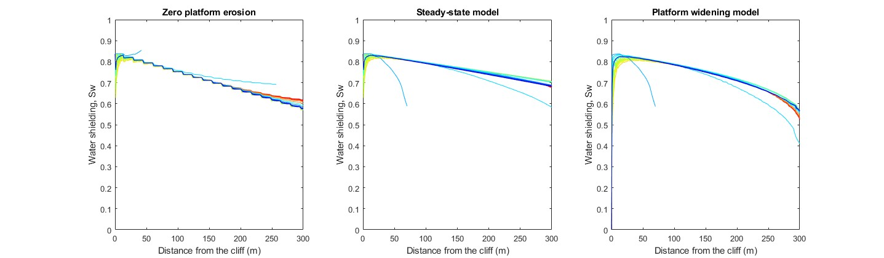
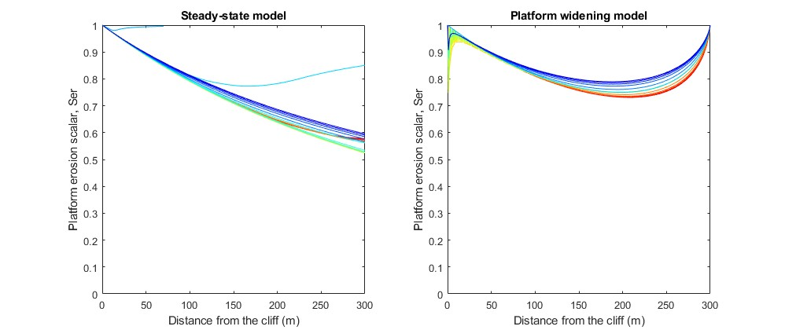

If 
