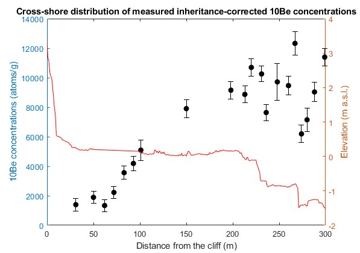
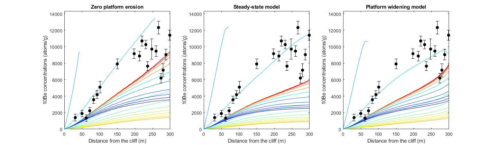
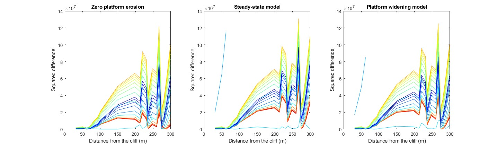
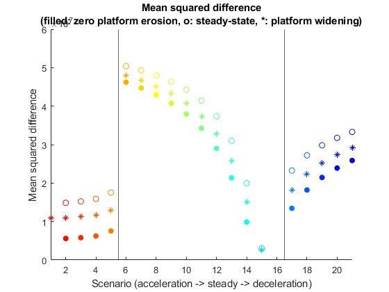
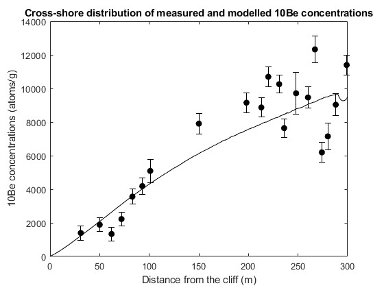
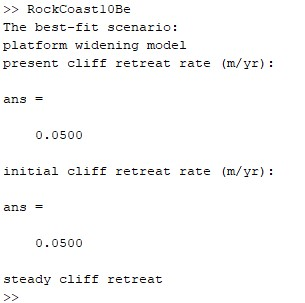

# RockCoast10Be
Latest version: 2.0 (2025-07-01)

<em>RockCoast10Be.m</em> is a simple backward geometry-based model developped in MATLAB to explore cosmogenic 10Be concentrations across an active shore platform as a function of cliff retreat and shore platform down-wearing scenarios.

Please refer to the original paper when using this work: 
<b>Swirad, Z. M. et al. 2020. Cosmogenic exposure dating reveals limited long-term variability in erosion of a rocky coastline. Nature Communcations  11: 3804.</b> https://doi.org/10.1038/s41467-020-17611-9

The original code was provided as a supplement to Swirad et al. (2020). This GitHub repository contains a simplified and updated model. On the top of a clearer nomenclature, the differences include:
1. The empirical model of shore platform erosion at Staithes, UK was removed because of its limited utility elsewhere;
2. The required tidal information was limited to a single value of tidal range;
3. The topographic shielding is based on cliff geometry (inclination [90 degrees for a vertical cliff] and subtended azimuth [180 degrees for a cliff straight alongshore] angles);
4. The best-fit scenario can be identified based on the mean squared difference. If no 10Be data are available, please comment lines #24 and from #513 on.

The model requires three input files: 1. timeseries of geomagnetic scalar (<em>geomagnetics.txt</em> available in the repository), 2. topography data (a series of distances from the cliff and elevations) and 3. relative sea level (RSL) data (a series of time BP and RSL). 10Be concentration file can also be included for finding the best-fit scenario. The concentration file should have been corrected for inheritance beforehand. Then a number of variables needs to be defined: total time considered, shore platform width, tidal range, highest and lowest astronomical tide or highest and lowest elevation of shore platform above RSL, cliff height, inclination angle and subtended azimuth angle.

  
<b>Basic formula: [10Be] = P texp Sgm Stopo Sw Ser</b>

[10Be] = 10Be concentration (atoms/gram)

P = production rate (atoms/gram/yr)

texp = exposure time (yr)

Sgm = geomagnetic scalar

Stopo = topographic shielding

Sw = water shielding

Ser = platform erosion scalar (rock shielding)

  
<b>Scenarios considered:</b>

Cliff retreat scenarios:
- steady retreat
- linear acceleration
- linear deceleration

Shore platform erosion scenarios:
- zero platform erosion
- steady-state model (platform slope remains constant)
- platform widening model (slope decreases through time)

The user defines the rates for the steady cliff retreat. For the accelerating/decelerating scenarios the user defines the current rate as well as the series of values which indicate how many times the retreat rate was higher/lower and the begining of the considered period. All shore platform erosion scenarios are run; they are fully controlled by the current topography and the RSL history, and don't take any input from the user.

  
<b>Workflow - example from Staithes, UK:</b>

The four files used to run the code for Staithes (<em>geomagnetics.txt</em>, <em>profile.txt</em>, <em>sealevel.txt</em> and <em>measured_inheritance.txt</em>) are available in the repository. The user-defined parameters in the code file (<em>RockCoast10Be.m</em>) are also set for this example. If the user runs the code as it is, they will receive the same results as those provided below. For other locations, different inputs are needed.

When the input files are loadad and all parameters are set, the figures of cliff retreat rates through time and the resulting exposure ages are created for each cliff retreat scenario.

For each cliff retreat scenario the geomagnetic scalar, Sgm is calculated.

Similarly, each cliff retreat scenario has a different topographic shielding, Stopo distribution.

Subsequently the elevations, RSL and present water shielding, Sw (tidally-dependent) are explored. The best-fit cross-shore profile is created and used in the platform erosion modelling.

Water shielding, Sw and platform erosion scalar, Ser (rock shielding) are calculated separately for the three scenarios of shore platform erosion. For zero platform erosion Ser=1 and is not plotted.

If 10Be concentrations are available, the best-fit scenario can be identified. The concentrations are plotted with the topography and on the top of those predicted with different scenarios. Cross-shore distribution of squared difference between measured and modelled concentrations are illustrated.

Mean squared difference for each scenario of cliff retreat (x-axis) and platform erosion (symbol) is provided. The scenario with the lowest mean squarred difference is selected as the best-fit model and the information is printed.

The purpose of this example is to show how the model works. The results are different from those in Swirad et al. (2020) where only a portion of landward points were used to derive long-term cliff retreat rates and shore platform down-wearing. The seaward points were used to explore platform erosion via block removal (step back-wearing).
